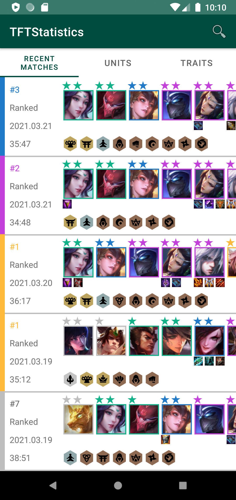

# TFT Statistics
Teamfight Tactics App using Riot Games API

## Getting Started
This project uses the Gradle build system. To build this project, use the gradlew build command or use "Import Project" in Android Studio.
There is Gradle task for testing the project:
* AndroidTest - for running Espresso on a connected device

### Riot API key
TFT Statistics uses the [Riot API](https://developer.riotgames.com) to access to game data.
To use the API, you will need to obtain a free developer API key. See the [Riot API Documentation](https://developer.riotgames.com/docs/tft) for instructions.

Once you have the key, add this line to the `gradle.properties` file, either in your user home
directory (usually `~/.gradle/gradle.properties`) or in the project's root folder:

```
RiotApiKey=<your riot api key>
```

## Screenshots
 

## Libraries used
* [LiveData](https://developer.android.com/reference/android/arch/lifecycle/LiveData)
* [ViewModels](https://developer.android.com/reference/android/arch/lifecycle/ViewModel)
* [ViewBinding](https://developer.android.com/topic/libraries/view-binding)
* [Navigation](https://developer.android.com/guide/navigation)
* [Hilt](https://developer.android.com/training/dependency-injection/hilt-android)
* [Retrofit 2](https://square.github.io/retrofit/)
* [Glide](https://github.com/bumptech/glide)
* [Coroutine](https://developer.android.com/kotlin/coroutines)
* [Espresso](https://developer.android.com/training/testing/espresso)